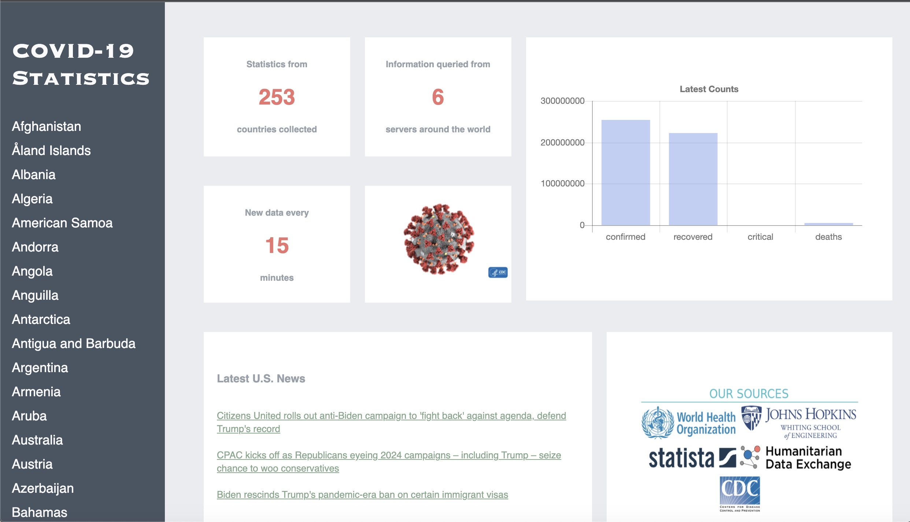
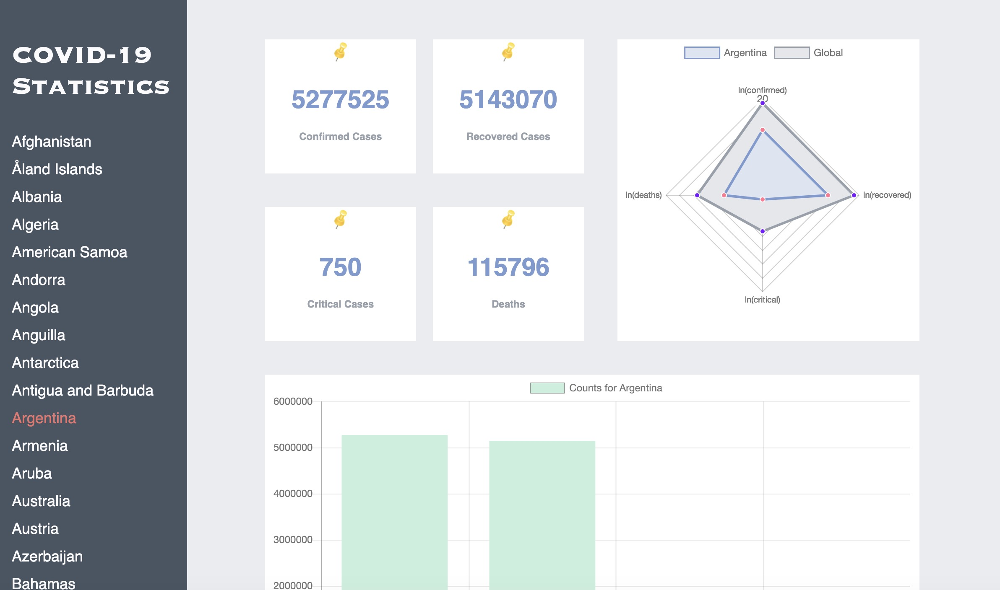

# Coronavirus Data Visualization WebApp

`covid19-data` is a data visualization web application written in Flask and deployed on Heroku that queries APIs over coronavirus data from credible sources such as the World Health Organization, JHU, CDC, and statista. 

